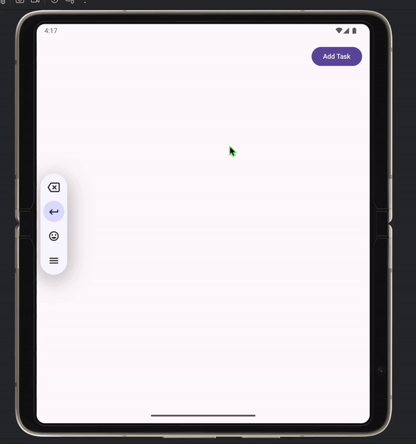

# ToDo App

Цей проект є простим додатком "To-Do", який дозволяє додавати завдання і переглядати їх у списку.

## Огляд

Ця гіфка демонструє роботу додатку. Користувач може додавати завдання натисканням кнопки "Add Task".
